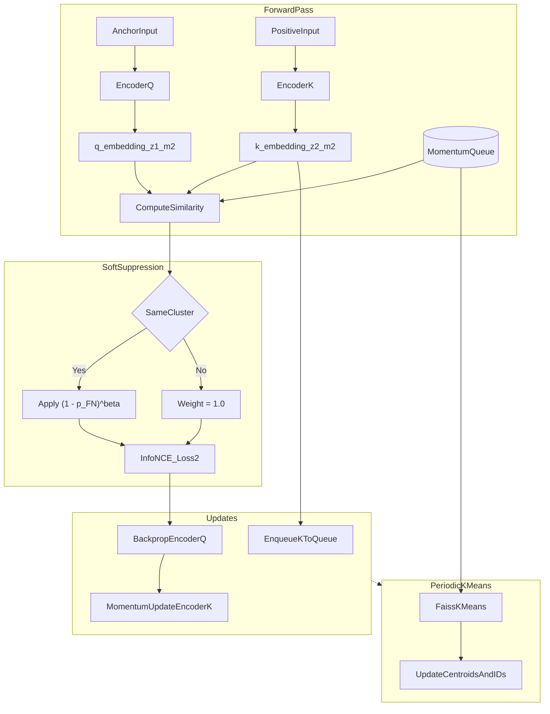

# CoT-BERT-Cluster 代码思路

本文档梳理 `CoT-BERT-Cluster` 目录中，在原始 CoT-BERT 对比学习框架上新增的 **动量队列 (Momentum Bank)**、**K-Means 聚类** 与 **软抑制 (Soft Suppression)** 机制的实现思路。

---

## 1. 背景与核心思想

### 1.1 问题

标准 InfoNCE 对比学习主要依赖 **batch 内负样本**。batch 较小时，负样本数量不足，表示学习效果受限。

引入 **动量队列** 后，可以把历史 batch 的特征作为额外负样本，显著扩大负样本池。但队列越大，**假负样本 (False Negatives)** 越多：语义相近的句子被当作负样本强行推开，会伤害表示质量。

### 1.2 解决思路

本目录采用三步策略：

1. **动量编码器 + 特征队列**：用 EMA 更新的 `encoder_k` 提取稳定特征，维护大规模 FIFO 队列。
2. **K-Means 聚类**：定期对队列特征聚类，为每个队列样本分配伪簇 ID，用于识别“可能语义相近”的负样本。
3. **软抑制 InfoNCE**：对疑似假负样本，不按硬删除处理，而是在 softmax 分母中施加连续权重 $(1 - p^{FN})^\beta$，降低其排斥力。

### 1.3 与原始 CoT-BERT 的关系

- 基座代码来自 `code-for-BERTNew`。
- 保留 CoT-BERT 的双 MASK、模板去噪、双 InfoNCE 损失（`loss1` + `loss2`）。
- 动量队列与软抑制 **仅作用于第二个 MASK 的 InfoNCE 损失 (`loss2`)**，与评估时使用的 `z1_m2` 表示一致。

---

## 2. 整体架构与数据流



### 2.1 训练一步的时序

1. `encoder_q`（主 BERT）前向，提取 `z1_m2`（anchor）与 batch 内正负样本相似度。
2. 若 `use_momentum_bank=True` 且处于训练模式：
   - EMA 更新 `encoder_k`
   - `encoder_k` 提取正样本 `z2_m2_k` 并入队
   - 计算 `q` 与队列全部特征的相似度 `queue_logits`
   - 对 `queue_logits` 做软抑制
   - 将抑制后的 `queue_logits` 拼接到 `cos_sim_m2`
3. 对扩展后的 logits 计算 `CrossEntropyLoss`，得到 `loss2`
4. 总损失：`loss = loss1 + loss2`
5. 每隔 `kmeans_steps` 步，回调触发 Faiss K-Means，刷新 `cluster_centroids` 与 `queue_cluster_ids`

---

## 3. 目录与文件职责

| 文件 | 作用 |
|------|------|
| `cot_bert_model.py` | 动量队列初始化、EMA 更新、入队、聚类、软抑制、前向传播集成 |
| `cot_bert_train.py` | 新增 `ModelArguments` 超参数、`KMeansUpdateCallback`、Trainer 回调注册 |
| `configs/train_*.yaml` | 训练配置，含 `use_momentum_bank` 等开关与超参 |
| `configs/evaluation_*.yaml` | 评估配置，**不需要**动量队列参数（评估只做特征提取） |
| `train_mac_m4.sh` / `train_linux_cuda.sh` | 平台训练启动脚本 |

---

## 4. 超参数说明

在 `cot_bert_train.py` 的 `ModelArguments` 与 `configs/train_*.yaml` 中新增：

| 参数 | 默认值 | 含义 |
|------|--------|------|
| `use_momentum_bank` | `false` | 是否启用动量队列与软抑制 |
| `queue_size` | `65536` | 特征队列容量 |
| `momentum` | `0.999` | `encoder_k` 的 EMA 动量系数 $m$ |
| `num_clusters` | `1000` | K-Means 聚类簇数 |
| `kmeans_steps` | `500` | 每隔多少 step 重新聚类一次 |
| `soft_suppression_beta` | `2.0` | 软抑制指数 $\beta$，权重为 $(1-p^{FN})^\beta$ |
| `fn_cluster_sim_threshold` | `0.5` | 将相似度映射为 $p^{FN}$ 的 sigmoid 阈值 |

训练配置示例见 `configs/train_mac_m4.yaml`、`configs/train_linux_cuda.yaml`、`configs/train_default.yaml`。

---

## 5. 核心代码模块

### 5.1 模型初始化：`momentum_bank_init`

位置：`cot_bert_model.py`

当 `use_momentum_bank=True` 时，在 `BertForCL` / `RobertaForCL.__init__` 中调用：

- `encoder_k = copy.deepcopy(encoder)`，冻结梯度
- `register_buffer` 注册：
  - `queue`: `[hidden_size, queue_size]`，L2 归一化随机初始化
  - `queue_ptr`: 队列入队指针
  - `queue_cluster_ids`: 队列中每个样本的簇 ID
  - `cluster_centroids`: `[num_clusters, hidden_size]` 聚类中心
- `_momentum_encoder_q` 指向主 encoder（`self.bert` 或 `self.roberta`）

### 5.2 动量更新：`momentum_bank_update_key_encoder`

EMA 更新公式：

$$\theta_k \leftarrow m \cdot \theta_k + (1 - m) \cdot \theta_q$$

在 `torch.no_grad()` 下执行，不参与反向传播。

### 5.3 队列入队：`momentum_bank_dequeue_and_enqueue`

- 输入：当前 batch 正样本特征 `keys`（已归一化）及其 `cluster_ids`
- 按 FIFO 写入 `queue` 与 `queue_cluster_ids`
- 支持队列尾部回绕

### 5.4 簇分配：`momentum_bank_assign_cluster_ids`

- 将 embedding 与 `cluster_centroids` 做余弦相似度
- 取最近簇 ID：`argmax(sim)`

### 5.5 定期聚类：`momentum_bank_run_kmeans`

- 使用 Faiss `Kmeans` 对 `queue` 中全部特征聚类
- 更新 `cluster_centroids` 与 `queue_cluster_ids`
- 若未安装 `faiss`，函数静默返回（不报错）

Trainer 侧通过 `KMeansUpdateCallback.on_step_end` 周期性调用 `model.run_kmeans()`。

### 5.6 特征提取复用：`_compute_pooler_output`

CoT-BERT 的特征提取包含：

- 多 MASK token 提取
- 模板去噪 (`denoising`)
- MLP 投影

该函数将上述逻辑抽离，供 `encoder_q` 与 `encoder_k` 共用，保证 query/key 特征空间一致。

### 5.7 软抑制核心：`momentum_bank_soft_suppress_queue_logits`

**输入**：`q`（anchor 表示）、`queue_logits`（$q$ 与队列的余弦相似度 / temperature）

**步骤**：

1. 计算 $q$ 的簇 ID，与 `queue_cluster_ids` 比较，得到 `same_cluster` 掩码
2. 由相似度估计假负概率：
   $$p^{FN}_{ij} = \sigma(\tau \cdot (\text{sim}_{ij} - \text{threshold}))$$
3. 若 `same_cluster`，将 $p^{FN}$ 下限设为 0.5
4. 计算抑制权重：
   $$W_{ij} = (1 - p^{FN}_{ij})^\beta$$
5. 在 logit 域施加权重（等价于 softmax 分母乘权重）：
   $$\text{logit}'_{ij} = \text{logit}_{ij} + \log W_{ij}$$

**设计含义**：

- 相似度高、同簇的队列样本 → $p^{FN}$ 大 → 权重小 → 排斥力弱
- 不像假负样本的队列项 → 权重接近 1 → 保持正常负样本作用

### 5.8 前向传播集成：`cl_forward`

软抑制接入点（第二个 MASK 的 InfoNCE）：

```python
# 1. batch 内 cos_sim_m2 已计算完毕
# 2. 动量队列分支
momentum_bank_update_key_encoder(cls)
pooler_output_k = _compute_pooler_output(..., encoder=cls.encoder_k, ...)
z2_m2_k = F.normalize(pooler_output_k[:, 1, 1, :], dim=-1)
momentum_bank_dequeue_and_enqueue(cls, z2_m2_k, k_cluster_ids)

q_norm = F.normalize(z1_m2, dim=-1)
queue_logits = torch.matmul(q_norm, cls.queue.clone().detach()) / cls.model_args.temp
queue_logits = momentum_bank_soft_suppress_queue_logits(cls, z1_m2, queue_logits)
cos_sim_m2 = torch.cat([cos_sim_m2, queue_logits], dim=1)

# 3. 对扩展后的 cos_sim_m2 计算 loss2
```

注意：

- 队列特征与 `encoder_k` 前向在 `no_grad` 下执行
- `queue.clone().detach()` 阻断梯度回传到历史特征
- 软抑制只影响 **队列负样本**，batch 内正负样本 logits 不变

---

## 6. 训练回调：`KMeansUpdateCallback`

位置：`cot_bert_train.py`

```python
class KMeansUpdateCallback(TrainerCallback):
    def on_step_end(...):
        if state.global_step % self.kmeans_steps == 0:
            unwrapped.run_kmeans()
```

注册方式：

```python
if model_args.use_momentum_bank:
    trainer_callbacks.append(KMeansUpdateCallback(model_args.kmeans_steps))
```

---

## 7. 启用与运行

### 7.1 依赖

- 训练基础依赖：与原 CoT-BERT 相同
- 聚类功能：`pip install faiss-cpu`（Linux CUDA 环境可用 `faiss-gpu`）

### 7.2 配置

在训练 yaml 中设置：

```yaml
use_momentum_bank: true
queue_size: 65536
momentum: 0.999
num_clusters: 1000
kmeans_steps: 500
soft_suppression_beta: 2.0
fn_cluster_sim_threshold: 0.5
```

### 7.3 启动训练

```bash
# Mac M4
bash train_mac_m4.sh

# Linux CUDA
bash train_linux_cuda.sh
```

### 7.4 评估

评估脚本读取 `configs/evaluation_*.yaml`，走 `sent_emb=True` 的特征提取路径，不经过动量队列与软抑制逻辑。

---

## 8. 关键设计选择说明

| 设计点 | 选择 | 原因 |
|--------|------|------|
| 软抑制 vs 硬删除 | 软抑制 | 避免误杀真负样本，保持训练稳定 |
| 聚类信号来源 | 队列特征 K-Means | 无监督场景下近似语义分组 |
| 抑制作用范围 | 仅 `loss2` + 队列负样本 | 与评估表示 (`z1_m2`) 对齐，改动面小 |
| key 特征来源 | `encoder_k` 提取 `z2_m2` | MoCo 风格，队列特征更稳定 |
| logit 域加权 | `logits + log(W)` | 等价于 softmax 分母乘权重，数值稳定 |

---

## 9. 与 FNR 论文指标的对应关系

- **FNR (False Negative Rate)**：计数型指标，统计 batch/队列中疑似假负样本比例
- **FNM (False Negative Mass)**：质量型指标，衡量假负样本在 InfoNCE 分母 softmax 中的有效质量
- **本实现的软抑制**：训练时缓解机制，通过 $(1-p^{FN})^\beta$ 降低疑似假负样本对损失的贡献，与 FNM 论文中的 Soft Suppression InfoNCE 思路一致

---

## 10. 后续可扩展方向

1. 将软抑制扩展到 batch 内负样本（当前仅作用于队列负样本）
2. 引入 Teacher 模型估计 $p^{FN}$，替代纯聚类 + 相似度启发式
3. 记录训练过程中的 FNR/FNM 统计，用于与 STS 性能相关性分析
4. 针对 Mac MPS / Linux CUDA 分别调优 `queue_size` 与 `kmeans_steps`
